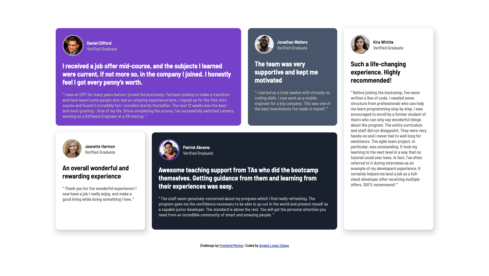

# Frontend Mentor - Testimonials grid section solution

This is a solution to the [Testimonials grid section challenge on Frontend Mentor](https://www.frontendmentor.io/challenges/testimonials-grid-section-Nnw6J7Un7). 

## Table of contents

- [Overview](#overview)
  - [The challenge](#the-challenge)
  - [Screenshot](#screenshot)
  - [Links](#links)
- [My process](#my-process)
  - [Built with](#built-with)
  - [What I learned](#what-i-learned)
  - [Continued development](#continued-development)
- [Author](#author)
- [Acknowledgments](#acknowledgments)

## Overview

### The challenge

Users should be able to:

- View the optimal layout for the site depending on their device's screen size

### Desktop Screenshot

### Links

- Solution URL: [Github repo](https://github.com/glopzel/frontendmentor-grid-testimonial)
- Live Site URL: [Live site on github pages](https://glopzel.github.io/frontendmentor-grid-testimonial/)

## My process

### Built with

- Semantic HTML5 markup
- CSS custom properties
- Flexbox
- CSS Grid

### What I learned

This was a great challenge to practice CSS Grid skills.

### Continued development

CSS can be improved.

## Author

- Frontend Mentor - [@glopzel](https://www.frontendmentor.io/profile/glopzel)
- Twitter - [@glopzel](https://www.twitter.com/glopzel)
